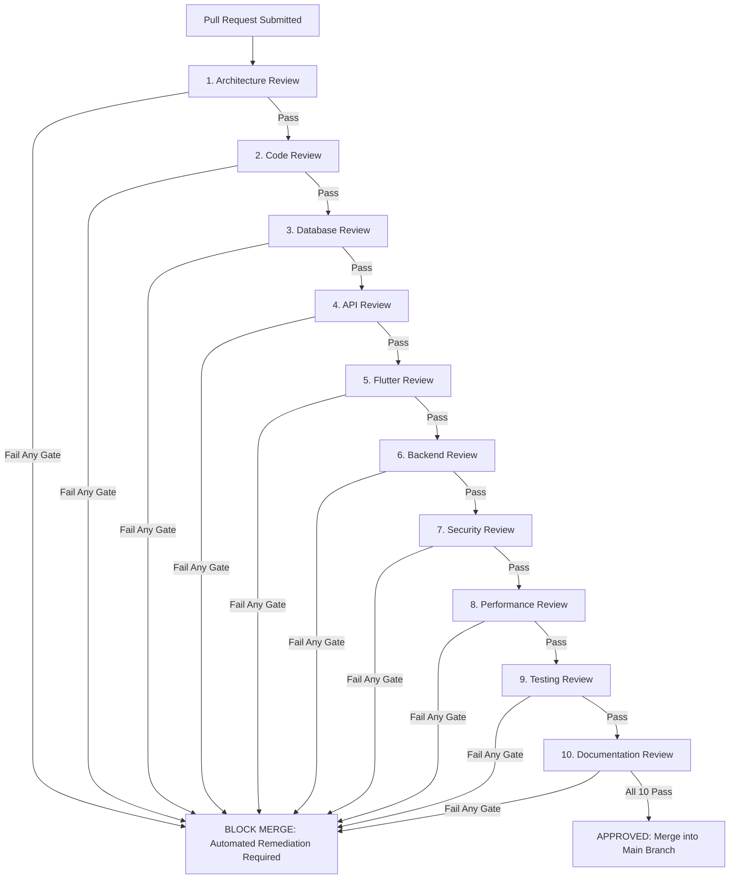

# Yoga24X AI Engineering OS — Engineering Bible (Version 1.0)

**Document Version**: 1.0.0-CONSTITUTION  
**Status**: APPROVED & LOCKED  
**Architectural Scope**: Permanent Single Source of Truth & Engineering Constitution for all current and future Yoga24X engineering prompts, architecture designs, module implementations, and quality evaluations.

---

## PART 1: EXECUTIVE VISION

### 1.1 Product Vision

To build the world's most intelligent, personalized, and accessible AI-powered Yoga & Wellness Super App, empowering **10 Million Active Students** and **100,000 Verified Teachers** globally through cutting-edge artificial intelligence, authentic Vedic wellness practices, and real-time biometric feedback.

### 1.2 Mission

Democratize authentic ancient Vedic yoga, Ayurvedic nutrition, mindfulness meditation, and clinical biomechanical posture coaching by transforming standard mobile devices and web browsers into interactive, AI-guided personal wellness sanctuaries.

### 1.3 Core Principles

1. **Authenticity First**: Honor ancient Vedic traditions, Patanjali Yoga Sutras, and Ayurvedic wisdom while elevating them through evidence-based biomechanical science.
2. **Privacy as a Human Right**: Treat biometric telemetry, health journals, and physical therapy logs with hospital-grade HIPAA/GDPR confidentiality.
3. **Zero-Latency Feedback**: Real-time physical correction and voice coaching must occur instantly without perceptible lag or digital friction.
4. **Inclusive Accessibility**: Wellness is for everybody and every body. The platform must seamlessly accommodate seniors, prenatal mothers, beginners, and students with chronic physical disabilities or neurodivergence.
5. **Holistic Mind-Body-Spirit Wellness**: Never treat physical fitness in isolation; integrate mental peace, pranayama breathwork, sleep hygiene, and nutritional harmony into every user journey.

### 1.4 Product Philosophy

Technology must remain invisible, adaptive, and empowering. The interface adapts dynamically to the student's inherent Prakriti (constitution), current Vikriti (imbalance), daily energy level, and physical limitations—the student never adapts to the software.

### 1.5 Business Goals

- **Year 1**: Achieve 1 Million Monthly Active Users (MAU), onboard 10,000 certified Yoga Alliance instructors, and process 1 Million class bookings.
- **Year 3**: Scale to 10 Million MAU, host 100,000 instructors, curate 1 Million LMS courses, process 10 Million monthly bookings, and maintain a subscription retention rate $>85\%$.

### 1.6 Success Metrics (KPIs)

- **User Engagement**: Daily Active Users (DAU) to Monthly Active Users (MAU) ratio $\ge 40\%$.
- **AI Efficacy**: Real-time Computer Vision Pose Coach alignment accuracy $\ge 95\%$ compared to expert physical therapist evaluation.
- **Streaming Performance**: Live interactive video streaming latency $\le 200\text{ms}$ globally.
- **Customer Satisfaction**: Net Promoter Score (NPS) $\ge 75$; App Store and Google Play rating $\ge 4.8$ stars.
- **Operational Reliability**: Enterprise infrastructure uptime $\ge 99.99\%$ (Four Nines), allowing maximum 52.6 minutes of unplanned downtime per year.

---

## PART 2: ENGINEERING CONSTITUTION

### 2.1 Engineering Principles

1. **Robustness by Default**: Systems must gracefully degrade under component failures, network splits, or third-party API outages without losing data or crashing client applications.
2. **Predictability over Cleverness**: Explicit, readable, and standardized patterns are valued over concise, complex meta-programming or obscure framework shortcuts.
3. **Observability Everywhere**: If a system component cannot be monitored, traced, and measured in real-time, it is considered broken and unfit for production.
4. **Zero Trust Security**: Never trust network perimeters, client devices, or internal service-to-service calls. Every request must be authenticated, authorized, and validated.
5. **Automation over Manual Intervention**: CI/CD pipelines, automated testing, infrastructure as code (IaC), and self-healing cron jobs must replace manual developer operations.

### 2.2 Clean Architecture Rules

- **Strict Dependency Rule**: Source code dependencies must point exclusively inward. Inner layers (Domain Entities and Use Cases) must NEVER import or depend on outer layers (Frameworks, Databases, HTTP Controllers, or UI Widgets).
- **Layer Boundaries**:
  - _Domain Layer_: Enterprise business rules, core entities, and value objects. Zero framework dependencies.
  - _Application / Use Case Layer_: Application-specific business logic, orchestration, and domain event emission.
  - _Interface / Presentation Layer_: HTTP Controllers, GraphQL resolvers, REST DTOs, and Flutter UI widgets/presenters.
  - _Infrastructure Layer_: Prisma ORM database access, Redis caching, AWS S3 adapters, third-party payment gateways, and email/push senders.

### 2.3 SOLID Rules

1. **Single Responsibility Principle (SRP)**: A class, module, or function must have exactly one reason to change. Separate data access, business validation, and presentation formatting into distinct classes.
2. **Open/Closed Principle (OCP)**: Software entities must be open for extension (via interfaces, abstract classes, and strategy plugins) but closed for direct modification.
3. **Liskov Substitution Principle (LSP)**: Subtypes and derived classes must be perfectly substitutable for their base types without altering system correctness or violating interface contracts.
4. **Interface Segregation Principle (ISP)**: Clients must never be forced to depend on interfaces or methods they do not use. Prefer small, highly cohesive, role-specific interfaces over large monolithic interfaces.
5. **Dependency Inversion Principle (DIP)**: High-level business logic modules must not depend on low-level infrastructure modules. Both must depend on abstractions (interfaces). Abstractions must not depend on details; details must depend on abstractions.

### 2.4 DRY Rules (Don't Repeat Yourself)

- Every significant business rule, database schema definition, API contract, error code, and UI design token must have a single, unambiguous representation within the monorepo workspace.
- Duplicate TypeScript interfaces, DTOs, validation schemas, or utility functions across frontend and backend apps are strictly forbidden; they must be extracted into shared monorepo packages (`packages/shared-types`, `packages/shared-utils`).

### 2.5 KISS Rules (Keep It Simple, Stupid)

- Avoid speculative over-engineering, premature optimization, and unnecessary architectural layers when simple, direct functions satisfy the requirements.
- Any architectural pattern or abstraction that increases cognitive load without solving an immediate, documented scalability or maintainability problem must be rejected during code review.

### 2.6 YAGNI Rules (You Aren't Gonna Need It)

- Never write code, database columns, API endpoints, or UI components for hypothetical future features.
- Implement only what is explicitly demanded by the current approved product specification and user story.

### 2.7 Domain-Driven Design (DDD) Rules

- **Ubiquitous Language**: Engineers, product managers, designers, and domain experts (yogi masters/doctors) must use an identical terminology dictionary across code, database schemas, API documentation, and UI labels (e.g., _Student_, _Teacher_, _Studio_, _Course_, _Lesson_, _Booking_, _Dosha_, _Prakriti_, _Asana_).
- **Aggregate Roots**: Every transactional modification must be governed by an Aggregate Root entity that enforces internal consistency invariants and transactional boundaries.
- **Entities vs. Value Objects**: Entities possess unique identity (`id`) and continuity over time; Value Objects (e.g., Money, DateRange, BiometricCoordinate, EmailAddress) are immutable and defined entirely by their structural attributes.

### 2.8 Event-Driven Rules

- All cross-module communication for secondary business flows (notifications, rewards, analytics, video processing, certificate generation) MUST occur asynchronously via versioned domain and integration events published to the enterprise event bus.
- Direct synchronous HTTP or RPC calls across bounded context modules for mutating workflows are strictly forbidden.

### 2.9 AI Engineering Rules

- **RAG Grounding Mandatory**: Generative LLMs must never be queried for health, dietary, or posture advice without injecting authoritative context retrieved from the vector Knowledge Base (Retrieval-Augmented Generation).
- **Structured Output Enforcement**: All AI responses consumed by client apps or backend services must be constrained to strict JSON schemas; free-form markdown responses are permitted only in direct conversational chat bubbles.
- **Confidence Gating**: If an AI engine's internal confidence evaluation falls below $85\%$, the system must automatically suppress the AI recommendation, route the query to a human teacher review queue, and display a fallback disclaimer.

### 2.10 Security by Design

- Security is not a feature added at release; it is an architectural prerequisite embedded into every layer: default-deny authorization, mandatory parameter validation, encryption at rest and in transit, automated key rotation, and strict multi-tenant Row Level Security (RLS).

### 2.11 Test-First Philosophy

- All engineers must practice Test-Driven Development (TDD) or test-concurrent engineering. Zero source code may be merged into the default branch without accompanying automated tests proving functional correctness, edge-case handling, and failure resilience.

---

## PART 3: TECHNOLOGY STACK (OFFICIAL FREEZE)

The technology stack for Yoga24X is permanently frozen. No framework, database, or core library may be substituted without formal executive architectural review and amendment of this constitution.

| Layer / Domain        | Frozen Technology Selection & Version Specs                                                                                                | Official Purpose & Engineering Justification                                                                                            |
| :-------------------- | :----------------------------------------------------------------------------------------------------------------------------------------- | :-------------------------------------------------------------------------------------------------------------------------------------- |
| **Frontend Mobile**   | **Flutter** (Latest Stable 3.24+), Dart 3.5+, Riverpod 2.0+, Freezed, GoRouter                                                             | Cross-platform iOS & Android mobile app delivering native 60fps performance, custom animations, and WebRTC video integration.           |
| **Admin Panel**       | **Next.js 15** (App Router), TypeScript 5.5+, Tailwind CSS 3.4+, Shadcn UI, TanStack Query, React Hook Form + Zod                          | Enterprise web administration portal for studio owners, teachers, medical evaluators, and system super-administrators.                  |
| **Backend API**       | **NestJS 10+**, TypeScript 5.5+, Node.js 20 LTS, Express/Fastify adapter, Auth.js / Passport                                               | High-performance, modular TypeScript backend server enforcing clean architecture, DI, and robust OpenAPI contracts.                     |
| **Database**          | **PostgreSQL 16** (RDS Multi-AZ), **Prisma ORM 5+**, `pgvector`, `pg_trgm`, `btree_gist`                                                   | Enterprise relational database providing ACID transactions, multi-tenant RLS, vector embeddings, and exclusion locks.                   |
| **Cloud Platform**    | **Amazon Web Services (AWS)** — EKS/ECS, S3, CloudFront CDN, RDS Aurora, ElastiCache, Lambda, KMS, Secrets Manager, Elemental MediaConvert | Global, highly available cloud infrastructure providing multi-AZ fault tolerance, serverless computing, and media transcoding.          |
| **Caching & Queues**  | **Redis 7 Cluster** (6 Nodes: 3 Masters, 3 Replicas across Multi-AZ), **BullMQ**                                                           | Sub-millisecond distributed caching, rate limiting Lua scripts, leaderboard sorted sets, and reliable background job processing.        |
| **Object Storage**    | **AWS S3** with Lifecycle Policies (Standard $\to$ IA $\to$ Glacier Instant Retrieval) + Object Lock (WORM)                                | Highly durable object storage for video HLS chunks, images, PDF certificates, and immutable security audit log archives.                |
| **Search Engine**     | **Meilisearch / Elasticsearch** (Lexical BM25) + **PostgreSQL pgvector** (Semantic Cosine Sim) via RRF                                     | Unified hybrid search engine across 11 domain indexes with typo tolerance, faceted filtering, and sub-20ms autocomplete.                |
| **Authentication**    | **JWT** (RS256 Asymmetric, 15m TTL), Refresh Tokens (Opaque UUID, 7d TTL), Google OAuth 2.0 SSO, Twilio/AWS SNS OTP                        | Stateless, secure authentication with automated JWKS public key rotation, Redis revocation blocklist, and multi-channel OTPs.           |
| **Notifications**     | **Firebase Cloud Messaging (FCM)**, Apple APNs, AWS SES / SendGrid, Twilio SMS/WhatsApp, Web Push API                                      | Multi-channel messaging engine supporting granular user preferences, i18n localization, smart digest batching, and tracking.            |
| **Payments**          | **Razorpay** (Primary Gateway), UPI, Credit/Debit Cards, NetBanking, Razorpay Mandates                                                     | Secure PCI-DSS compliant billing engine supporting Indian and global currencies, recurring auto-debits, and instant refunds.            |
| **Analytics & OLAP**  | **OpenTelemetry (OTel)**, Prometheus, Grafana, Google Analytics for Firebase, ClickHouse                                                   | Real-time infrastructure metrics, distributed tracing, mobile Core Web Vitals RUM, and high-speed telemetry aggregations.               |
| **Monitoring & Logs** | **Grafana Loki** (ECS JSON Logs), **Grafana Tempo** / AWS X-Ray (Traces), **Sentry** (Crash Reporting), PagerDuty                          | Full-stack observability suite providing unified dashboards, exception tracking, and automated SEV-1 incident alerting.                 |
| **CI/CD & GitOps**    | **GitHub Actions** (Monorepo Turbo orchestration), Docker, AWS ECR, ArgoCD Kubernetes GitOps                                               | Automated zero-downtime CI/CD pipelines enforcing static analysis, test coverage gating, vulnerability scanning, and semantic releases. |
| **AI Stack**          | **Google Gemini 1.5 Pro / Flash**, Anthropic Claude 3.5 Sonnet, OpenAI GPT-4o, Vertex AI (`text-embedding-004`), MediaPipe / MoveNet       | Multi-engine generative AI tier providing reasoning, RAG grounding, voice coaching, and 30fps edge computer vision pose analysis.       |

---

## PART 4: ARCHITECTURE BIBLE (OFFICIAL FREEZE)

### 4.1 System & Monorepo Architecture

Yoga24X is organized as an enterprise monorepo managed by **pnpm workspaces** and orchestrated by **Turborepo**. The backend is deployed initially as a high-performance **Modular Monolith** within a NestJS runtime, structured with strict Bounded Context isolation to enable seamless future extraction into Kubernetes microservices without breaking client contracts.

### 4.2 Module Layering Architecture

Every NestJS backend module MUST strictly enforce a 3-tier internal layering hierarchy:

1. `Controller` (`*.controller.ts`): Stateless HTTP/REST endpoint handler. Extracts request parameters, invokes DTO validation, delegates execution to Domain Services, and formats standard JSON responses. Zero business logic permitted.
2. `Service` (`*.service.ts`): Domain business logic and use case orchestrator. Manages transaction boundaries, enforces domain rules, and emits CloudEvents to the Event Bus.
3. `Repository` (`*.repository.ts`): Data access abstraction wrapping Prisma ORM. Enforces soft-delete checks (`deleted_at IS NULL`), injects Row Level Security tenant context, and optimizes SQL queries.

### 4.3 Official Folder Structure

```text
yoga24x-super-app/
├── apps/
│   ├── backend/                     # NestJS Modular Monolith API & BullMQ Workers
│   │   ├── src/
│   │   │   ├── modules/             # Bounded Context Modules
│   │   │   │   ├── iam/             # Identity, Auth, Users, Roles, Tenants
│   │   │   │   ├── learning/        # LMS Courses, Lessons, Quizzes, Certificates
│   │   │   │   ├── booking/         # Class Scheduling, Calendars, Room Inventory
│   │   │   │   ├── finance/         # Payments, Wallets, Ledgers, Referrals
│   │   │   │   ├── intelligence/    # AI Gateway, RAG, Pose Analysis, Nutrition
│   │   │   │   ├── social/          # Community Feeds, Posts, Comments, Moderation
│   │   │   │   └── notification/    # Multi-channel Dispatch, Templates, Preferences
│   │   │   ├── core/                # Global Interceptors, Guards, Pipes, Filters
│   │   │   ├── infra/               # Prisma Client, Redis, BullMQ, S3 Adapters
│   │   │   └── main.ts              # Application Bootstrap & Swagger Init
│   │   ├── prisma/
│   │   │   ├── schema.prisma        # Enterprise 64-Table Relational Schema
│   │   │   └── migrations/          # SQL Migration History
│   │   ├── test/                    # Jest E2E & Integration Test Suites
│   │   └── package.json
│   ├── admin/                       # Next.js 15 Web Administration Portal
│   │   ├── src/
│   │   │   ├── app/                 # App Router Pages & API Routes
│   │   │   ├── components/          # Shadcn UI & Custom Web Components
│   │   │   ├── hooks/               # TanStack Query & Custom React Hooks
│   │   │   └── lib/                 # API Clients & Utility Wrappers
│   │   └── package.json
│   └── mobile/                      # Flutter iOS & Android Mobile Application
│   │       ├── lib/
│   │       │   ├── src/
│   │       │   │   ├── features/    # Feature-First Modules (auth, lms, booking, ai_coach)
│   │       │   │   ├── core/        # GoRouter, Themes, Network Dio, Local Storage
│   │       │   │   └── shared/      # Common UI Widgets & Animations
│   │       │   └── main.dart        # Riverpod ProviderScope & App Bootstrap
│   │       ├── test/                # Unit, Widget, and Integration Tests
│   │       └── pubspec.yaml
├── packages/
│   ├── shared-types/                # Shared TypeScript Interfaces, DTOs, Zod Schemas
│   ├── shared-utils/                # Currency/Date Formatters, Encryption, Constants
│   ├── ui-tokens/                   # Design System Colors, Typography, Spacing JSON
│   └── eslint-config/               # Shared Monorepo ESLint & Prettier Rules
├── infra/
│   ├── docker/                      # Docker Compose Dev Stack & Production Dockerfiles
│   ├── k8s/                         # Kubernetes Helm Charts & ArgoCD GitOps Manifests
│   └── terraform/                   # AWS Cloud Infrastructure as Code (IaC)
├── docs/                            # Permanent Engineering & Architecture Documentation
├── package.json                     # Monorepo Root Configuration
├── pnpm-workspace.yaml              # pnpm Workspace Declaration
└── turbo.json                       # Turborepo Task Pipeline Orchestration
```

### 4.4 Bounded Contexts & Module Isolation Rules

- **7 Official Bounded Contexts**: `IAM`, `Learning`, `Booking`, `Finance`, `Intelligence`, `Social`, `Notification`.
- **Rule 1 (Zero Cross-Module DB Joins)**: A SQL query inside one module cannot join tables belonging to another module's logical schema namespace (e.g., `SELECT * FROM bkg_bookings JOIN iam_users ...` is illegal).
- **Rule 2 (No Direct Repository Imports)**: A service in Module A cannot import or inject the repository of Module B.
- **Rule 3 (Contract-Only Communication)**: Synchronous reads across modules must use exported readonly service interfaces (`@yoga24x/iam-contracts`); asynchronous mutations must occur via versioned CloudEvents published to the Event Bus.

### 4.5 Naming Standards

- **File Names**: `kebab-case.extension` (e.g., `user-profile.service.ts`, `course-catalog.widget.dart`).
- **Class & Type Names**: `PascalCase` (e.g., `UserRegistrationDto`, `PoseAnalysisEngine`, `BookingStateNotifier`).
- **Variables & Methods**: `camelCase` (e.g., `calculateTotalRevenue()`, `activeEnrollmentCount`).
- **Constants & Env Vars**: `SCREAMING_SNAKE_CASE` (e.g., `MAX_RETRY_ATTEMPTS`, `JWT_ACCESS_SECRET`, `RAZORPAY_KEY_ID`).

---

## PART 5: DATABASE CONSTITUTION (OFFICIAL FREEZE)

### 5.1 Naming & Schema Structure

- All database tables, columns, indexes, and constraints must use lowercase `snake_case`.
- Table names must be plural nouns (e.g., `users`, `course_enrollments`, `calendar_slots`, `wallet_transactions`).
- Logical schema separation must be maintained via table naming prefixes corresponding to bounded contexts (`iam_*`, `lms_*`, `bkg_*`, `fin_*`, `intl_*`, `soc_*`, `ntf_*`).

### 5.2 Primary & Foreign Keys

- **Primary Keys**: Opaque string IDs prefixed with domain identifiers and generated using KSUID, ULID, or UUIDv7 (e.g., `usr_01h...`, `bkg_01h...`, `crs_01h...`). Auto-incrementing integers are strictly forbidden to prevent ID enumeration attacks and distributed ID collisions.
- **Foreign Keys**: Explicit foreign key constraints must be defined in PostgreSQL for all relational links.
- **Referential Integrity**:
  - `ON DELETE RESTRICT`: Enforced on core financial, user, teacher, and catalog entities (cannot delete a user who has active payment ledgers or published courses).
  - `ON DELETE CASCADE`: Enforced only on transient child records (e.g., refresh token families, lesson progress checkpoints, notification logs).

### 5.3 Indexing Standards

- Every foreign key column MUST have an accompanying B-tree index.
- GIN indexes must be created on all `JSONB` attributes and text array columns (`tags`, `media_asset_ids`).
- GIN trigram indexes (`pg_trgm`) must be created on searchable text fields (`course.title`, `teacher.bio`) to enable fast fuzzy lexical search.
- HNSW vector indexes (`vector_cosine_ops`) must be created on all `pgvector` embedding columns (`user_embeddings`, `knowledge_chunks`) with `m = 16` and `ef_construction = 64` for sub-10ms similarity queries.
- GiST exclusion constraints (`EXCLUDE USING gist`) must be defined on calendar schedules (`calendar_slots`) to structurally prevent overlapping room or teacher bookings under concurrent traffic spikes.

### 5.4 Migration & Evolution Strategy

- All database schema evolutions must follow the **Expand-and-Contract (Parallel Change)** pattern to guarantee zero-downtime rolling deployments.
- **Rule**: Never drop a column, rename a column, or alter a data type incompatibly in a single release.
  - _Phase 1 (Expand)_: Add the new column as nullable or with a default value. Deploy application code that writes to both old and new columns.
  - _Phase 2 (Migrate)_: Execute a background data migration script to backfill historical data from the old column to the new column.
  - _Phase 3 (Contract)_: Deploy application code that reads and writes exclusively to the new column. In a subsequent migration release, drop the old column.
- All migrations must be written in Prisma SQL migrations and checked into source control; manual database modifications in staging or production are strictly illegal.

### 5.5 Soft Delete & Audit Trails

- **Soft Delete**: Every primary business entity table MUST include a `deleted_at TIMESTAMP WITH TIME ZONE NULL` column. Hard `DELETE` SQL statements are prohibited for user-facing data. All Prisma queries must automatically filter `WHERE deleted_at IS NULL` via global client extensions.
- **Audit Columns**: Every table MUST include:
  - `created_at TIMESTAMP WITH TIME ZONE NOT NULL DEFAULT NOW()`
  - `updated_at TIMESTAMP WITH TIME ZONE NOT NULL` (updated via automated database trigger or Prisma middleware)
  - `created_by VARCHAR(64) NULL` and `updated_by VARCHAR(64) NULL` capturing the actor ID.

### 5.6 Multi-Tenant Isolation via Row Level Security (RLS)

- Multi-tenancy is enforced at the database engine level. Every tenant-scoped or user-private table MUST enable PostgreSQL **Row Level Security (RLS)** (`ALTER TABLE <table_name> ENABLE ROW LEVEL SECURITY;`).
- Upon acquiring a database connection from the pool, the backend must execute:
  ```sql
  SET LOCAL app.current_tenant_id = '<jwt.tenant_id>';
  SET LOCAL app.current_user_id = '<jwt.user_id>';
  ```
- RLS policies must automatically restrict SQL `SELECT`, `INSERT`, `UPDATE`, and `DELETE` operations to rows matching `tenant_id = NULLIF(current_setting('app.current_tenant_id', true), '')`.

### 5.7 Declarative Range Partitioning

- High-velocity, append-only tables exceeding 1 million rows per month MUST implement PostgreSQL declarative range partitioning by month:
  - `audit_logs` (Security and administrative audit trails)
  - `pose_accuracy_logs` (AI Computer Vision biometric frame evaluations)
  - `wallet_transactions` (Financial ledger credits and debits)
  - `notification_logs` (Multi-channel delivery tracking histories)
- Automated cron schedulers must provision new monthly partitions 30 days in advance (`CREATE TABLE audit_logs_y2026m08 PARTITION OF audit_logs FOR VALUES FROM ('2026-08-01') TO ('2026-09-01');`).

### 5.8 Scalability & Replication Topology

- **Primary-Replica Topology**: Database tier deployed as 1 Primary Master (Handling all `INSERT`, `UPDATE`, `DELETE`, and ACID transactions) paired with 3+ Auto-Scaling Aurora Read Replicas (Handling all idempotent `SELECT` queries and analytical reporting).
- **Connection Pooling**: **PgBouncer** must be deployed in transaction pooling mode between NestJS services and PostgreSQL RDS, multiplexing 10,000+ stateless application connections over a disciplined pool of 200 physical database connections.

---

## PART 6: AI CONSTITUTION (OFFICIAL FREEZE)

### 6.1 AI Architecture & Service Responsibilities

- **AI Gateway**: Single secure proxy handling all external LLM invocations. Enforces JWT authentication, per-tenant/per-user token budgets, rate limiting, and PII scrubbing before outgoing API transmission.
- **Prompt Orchestrator**: Central intelligence coordinator. Assembles prompts by injecting RAG context from the Knowledge Base, short-term Redis session memory, and student health telemetry; enforces JSON schema output validation.
- **LLM Router**: Dynamic routing engine directing real-time dialogue to high-speed models (Gemini Flash / Claude 3 Haiku) and complex curriculum/medical reasoning to heavy reasoning models (Gemini 1.5 Pro / GPT-4o).
- **Knowledge Base**: Authoritative vector repository of Vedic yoga scriptures, Ayurvedic nutrition rules, and clinical physical therapy contraindications indexed via 1536-dimensional embeddings.
- **Memory Engine**: Short-term Redis session cache (24h TTL) storing active workout biometrics + Long-term PostgreSQL `pgvector` store maintaining historical student progress and preference vectors.

### 6.2 Prompt Engineering & Governance Rules

- Zero hardcoded prompt strings are permitted in application source code. All system prompts, persona instructions, and few-shot examples must be stored in the database `prompt_templates` table.
- Prompts must be parameterized using Handlebars/Jinja2 syntax (`{{student_name}}`, `{{dosha_type}}`, `{{injury_history}}`) and versioned semantically (`v1.0.0`, `v1.1.0`).
- Every prompt template update must undergo automated regression testing against a golden evaluation dataset before promotion to production.

### 6.3 Hallucination Prevention & AI Safety Rails

- **3-Layer Safety Rail Mandatory**:
  1. _RAG Grounding_: Every health, dietary, or posture query must retrieve verified contraindication rules from the Knowledge Base before LLM inference.
  2. _Structured JSON Enforcement_: LLM outputs must be parsed and validated against strict JSON schemas using Zod/Pydantic output parsers; malformed responses must be rejected and retried.
  3. _Confidence Gating & Human Handoff_: If the LLM's internal evaluation or RAG similarity score falls below **85%**, the AI response is suppressed, the query is routed to a human yoga teacher review queue, and the student receives a safe fallback disclaimer.
- **Medical Disclaimer Injection**: All wellness, nutritional, and workout plans generated by AI must automatically append an explicit medical disclaimer: _"This AI-generated plan is for educational wellness purposes and does not constitute clinical medical advice. Consult your physician before starting any physical exercise program."_

### 6.4 PII Scrubbing Rules

- The AI Gateway must execute automated regex and Named Entity Recognition (NER) scrubbing on all incoming prompts before sending payloads to external LLM providers (OpenAI, Anthropic, Google).
- Student legal names, email addresses, phone numbers, government ID numbers, exact dates of birth, and precise residential street addresses must be replaced with opaque tokens (`[STUDENT_NAME]`, `[EMAIL_REDACTED]`, `[AGE_32]`).

---

## PART 7: EVENT CONSTITUTION (OFFICIAL FREEZE)

### 7.1 CloudEvents v1.0 Specification

All integration events published across bounded contexts must strictly adhere to the **CloudEvents v1.0** JSON schema specification:

```json
{
  "specversion": "1.0",
  "id": "UUIDv4_string",
  "source": "/bounded_context/service_name",
  "type": "bounded_context.entity.past_tense_action.version",
  "datacontenttype": "application/json",
  "subject": "aggregate_root_id",
  "time": "ISO_8601_UTC_timestamp",
  "partition_key": "causal_ordering_key",
  "correlation_id": "request_or_trace_id",
  "data": { ...domain_payload }
}
```

### 7.2 Event Naming & Versioning

- Syntax: `<bounded_context>.<entity>.<past_tense_action>.<schema_version>` (e.g., `iam.user.registered.v1`, `learning.course.completed.v1`, `finance.payment.succeeded.v1`).
- Schema changes adding optional fields do not increment the version suffix.
- Breaking schema changes (removing fields, changing data types) MUST increment the version suffix (`v1` $\to$ `v2`). Producers must double-publish both versions during a mandatory 30-day deprecation window.

### 7.3 Reliability: Retries, DLQ, Ordering, and Idempotency

- **Retry Policy**: Exponential backoff with jitter: $\text{Delay} = \min(86400000\text{ms}, 2000\text{ms} \times 2^{attempt} + \text{jitter})$, up to 5 retry attempts over 24 hours.
- **Dead Letter Queue (DLQ)**: Events failing 5 retry attempts are moved atomically to `<queue_name>:dlq`, triggering PagerDuty/Slack SEV-1 alerts and retaining immutable headers for automated replay.
- **Causal Ordering**: Events sharing the same `partition_key` (e.g., `booking_id` or `user_id`) are guaranteed strictly ordered FIFO delivery by the broker.
- **Idempotency Strategy**: Consumers must enforce exactly-once processing via a two-stage check:
  1. Fast Redis check: Query key `idempotency:consumer:<name>:event:<id>` (7-day TTL).
  2. ACID Database check: Insert `event_id` inside an atomic SQL transaction into `processed_events` table (`PRIMARY KEY (consumer_name, event_id)`). Unique constraint violations cleanly abort duplicate processing without re-executing business logic.

---

## PART 8: API CONSTITUTION (OFFICIAL FREEZE)

### 8.1 REST Standards & Versioning

- All HTTP APIs must be OpenAPI 3.1 compliant RESTful services using standard resource nouns (`GET /api/v1/courses`, `POST /api/v1/bookings`) and correct HTTP status codes (`200 OK`, `201 Created`, `204 No Content`, `400 Bad Request`, `401 Unauthorized`, `403 Forbidden`, `404 Not Found`, `409 Conflict`, `429 Too Many Requests`, `500 Internal Server Error`).
- URL path versioning (`/api/v1/`, `/api/v2/`) is mandatory. Header or query parameter versioning is illegal.

### 8.2 Pagination, Filtering, and Sorting

- **Cursor-Based Pagination Mandatory**: All list endpoints must implement cursor pagination (`GET /api/v1/courses?cursor=base64string&limit=20`). Offset-based pagination (`?page=5&size=20`) is strictly prohibited.
- **Filtering**: Use standardized bracket query notation (`?filter[status]=CONFIRMED&filter[difficulty]=BEGINNER`).
- **Sorting**: Use standardized sorting syntax (`?sort=-created_at,rating` where `-` indicates descending order).

### 8.3 Error Handling & RFC 7807 Problem Details

All API error responses must strictly conform to the **RFC 7807 Problem Details** JSON specification:

```json
{
  "type": "https://api.yoga24x.com/errors/ERR_BKG_4009",
  "title": "Calendar Slot Unavailable",
  "status": 409,
  "detail": "The requested class time slot is already fully booked or locked by another concurrent transaction.",
  "instance": "/api/v1/bookings/reserve",
  "code": "ERR_BKG_4009",
  "timestamp": "2026-07-06T12:36:54.000Z",
  "invalid_params": [
    {
      "name": "slot_id",
      "reason": "Slot slt_998877 is at maximum capacity (25/25)."
    }
  ]
}
```

### 8.4 Validation & Rate Limiting

- **Payload Validation**: All incoming request bodies, query strings, and URL parameters must be validated against Zod / class-validator DTO schemas at the NestJS global pipe layer. Extra unwhitelisted fields must be stripped automatically (`whitelist: true`, `forbidNonWhitelisted: true`).
- **Rate Limit Headers**: Every HTTP response must include standard rate limit headers: `X-RateLimit-Limit`, `X-RateLimit-Remaining`, and `X-RateLimit-Reset`. When breached, the API must return `429 Too Many Requests`.

---

## PART 9: FLUTTER CONSTITUTION (OFFICIAL FREEZE)

### 9.1 Architecture & State Management

- **Feature-First Folder Structure**: Code must be organized by feature: `/lib/src/features/<feature_name>/{data, domain, presentation, application}` alongside `/lib/src/core/` for routing, theme, network, and utils.
- **Riverpod 2.0+ Mandatory**: All dependency injection, state management, and asynchronous data fetching must use **Riverpod Code Generation (`@riverpod`)**. Global mutable singletons, `StatefulWidget` complex logic, or standard `setState` for domain data are forbidden.
- **Immutability via Freezed**: All domain models, state classes, and API DTO representations in Dart must be generated as immutable classes using the **Freezed** package with `fromJson`/`toJson` serialization.

### 9.2 Navigation, Themes, and Localization

- **Declarative Navigation**: **GoRouter** is mandatory for all app routing, deep linking, authentication redirect guards, and nested tab navigation (`StatefulShellRoute`).
- **Design System & Themes**: Material 3 (M3) design system enforced. Light and dark theme data must be cleanly separated and consume design tokens from `/packages/ui-tokens/`.
- **Localization (i18n)**: `flutter_localizations` and `intl` package with ARB files (`app_en.arb`, `app_hi.arb`, `app_es.arb`). Zero hardcoded English strings are permitted in UI widgets.

### 9.3 Performance, Offline-First, and Error Handling

- **FPS Target**: The mobile app must maintain a rock-solid **60 FPS** (or 120 FPS on ProMotion displays) during scrolling, complex animations, and live video streaming. Heavy computations or JSON parsing must execute on background Dart Isolates (`compute()`).
- **Offline-First Strategy**: Enrolled LMS courses, daily meditation audio, and student practice logs must be cached locally using **Isar / Hive / SQLite**. Network mutations executed offline must queue in a local background sync box and replay automatically when connectivity restores.
- **Global Error Handling**: Unhandled Dart exceptions must be caught by `PlatformDispatcher.instance.onError` and `FlutterError.onError`, reporting full stack traces and user interaction breadcrumbs to Sentry while displaying friendly UI snackbars.

---

## PART 10: BACKEND CONSTITUTION (OFFICIAL FREEZE)

### 10.1 NestJS Standards & CQRS

- **Strict Modularity**: NestJS applications must be organized into highly cohesive, loosely coupled feature modules. Circular dependencies between modules are strictly illegal and will break CI/CD builds.
- **CQRS Decision**: Complex domains (`Learning`, `Booking`, `Finance`) must apply lightweight Command Query Responsibility Segregation (CQRS). Separate write Command Services (executing domain validation, ACID transactions, and event emission) from read Query Services (executing optimized, denormalized SQL reads or Meilisearch queries).

### 10.2 Controllers, Services, and Repositories

- **Controllers**: Thin, stateless HTTP endpoints. Responsible solely for request extraction, DTO validation, invoking Domain Services, and formatting HTTP responses. Zero business logic or database queries allowed.
- **Services**: Pure domain business logic execution. Enforces invariants, orchestrates multi-step workflows, manages transaction boundaries, and publishes CloudEvents.
- **Repositories**: Data access abstraction layer wrapping Prisma ORM. Enforces soft-delete filtering, injects Row Level Security tenant variables, and handles database pagination.

### 10.3 Transactions, Logging, and Caching

- **ACID Transactions**: Any business operation modifying more than one database record (e.g., booking a class and debiting a wallet) must execute inside an interactive Prisma transaction (`prisma.$transaction()`) with explicit isolation levels (`READ COMMITTED` or `SERIALIZABLE` for financial ledgers).
- **Structured Logging**: Use `Winston` / `Pino` emitting structured JSON formatted to Elastic Common Schema (ECS). Mandatory inclusion of `x-correlation-id`, `x-trace-id`, `tenant_id`, and `user_id` on every log line.
- **Declarative Caching**: Use two-tier Redis Cluster caching. Highly read, idempotent service methods must use declarative caching decorators with explicit TTLs and tag-based invalidation triggers.

---

## PART 11: SECURITY CONSTITUTION (OFFICIAL FREEZE)

### 11.1 Authentication & Tokens

- **JWT Access Tokens**: Stateless JSON Web Tokens signed via asymmetric RS256/ES256 cryptography. Maximum 15-minute TTL. Mandatory claims: `sub`, `iss`, `aud`, `exp`, `iat`, `jti`, `tenant_id`, `role`. Verified at API Gateway against public JWKS endpoint (`/api/v1/.well-known/jwks.json`).
- **Refresh Tokens**: Opaque 64-character cryptographically secure random hexadecimal strings. Maximum 7-day TTL. Stored hashed (SHA-256) in PostgreSQL `refresh_tokens` table and Redis. Enforces automatic token family rotation; if a previously used refresh token is presented, the entire token family is revoked instantly as suspected theft.
- **OTP & SSO**: 6-digit numeric OTPs sent via SMS/Email with 5-minute expiration and bcrypt hashing in DB; max 5 failed attempts before 30-minute lockout. Google OAuth 2.0 / OIDC SSO verified via backend cryptographic signature validation of Google ID tokens.

### 11.2 Encryption, Secrets, and Rate Limiting

- **Encryption**: TLS 1.3 enforced globally in transit with HSTS preloading. AES-256-GCM enforced at rest across all RDS PostgreSQL databases, Redis clusters, and S3 storage buckets via AWS KMS customer-managed keys.
- **Secrets Management**: All API keys, DB credentials, and private signing keys stored in HashiCorp Vault / AWS Secrets Manager. Injected into containers at runtime via memory-only tmpfs volumes. Zero secrets in Git, `.env` files, or Docker images. Automated 90-day rotation.
- **Rate Limiting**: Multi-tier Redis Lua sliding window counters: Global IP limit (10,000 req/min), Authenticated User limit (1,000 req/min), Sensitive Auth/OTP limit (5 req/15 min), AI Inference limit (50 req/min).

### 11.3 Authorization, Tenant Isolation, and OWASP

- **RBAC + ABAC**: Strict Role-Based Access Control (`SUPER_ADMIN`, `STUDIO_ADMIN`, `TEACHER`, `STUDENT`) combined with Attribute-Based Access Control evaluated at the gateway and NestJS guard layer.
- **Tenant Isolation**: Strict logical multi-tenancy enforced by PostgreSQL Row Level Security (RLS) database policies and Prisma client middleware injecting `SET LOCAL app.current_tenant_id`.
- **OWASP Top 10 Defense**: WAF rules blocking SQLi, XSS, SSRF, CSRF; parameterized SQL queries only via Prisma ORM; strict HTTP security headers (CSP, HSTS, X-Frame-Options, X-Content-Type-Options, Referrer-Policy, Permissions-Policy).
- **Audit Logging**: Immutable, append-only security audit trails stored in declarative monthly partitions (`audit_logs`) and mirrored to AWS S3 Object Lock WORM storage.

---

## PART 12: DEVOPS CONSTITUTION (OFFICIAL FREEZE)

### 12.1 Containerization & CI/CD Pipelines

- **Docker**: Multi-stage Dockerfiles (`base` $\to$ `dependencies` $\to$ `builder` $\to$ `runner`) utilizing lightweight Alpine or Distroless Node.js/Linux base images. Containers must execute as non-root users (`USER 1000:1000`) with read-only root filesystems and zero embedded secrets.
- **GitHub Actions CI/CD**: Automated pipelines enforcing strict quality gating:
  `Lint & Format Check` $\to$ `TypeScript Typecheck` $\to$ `Unit Tests (85% coverage)` $\to$ `Integration Tests (Testcontainers)` $\to$ `Build Docker Image` $\to$ `SAST & Vulnerability Scan (Trivy/Snyk)` $\to$ `Push to AWS ECR` $\to$ `GitOps Deploy via ArgoCD`.

### 12.2 Deployment & Environment Strategy

- **Kubernetes (AWS EKS)**: Auto-scaling container orchestration deploying pods across Multi-AZ node groups.
- **Deployment Strategy**: Blue/Green and Canary deployments mandatory for production releases. Automated rollback triggered instantly if Readiness probes fail or HTTP 5xx error rates exceed $1\%$ during the 15-minute canary window.
- **Environment Isolation**: Strict 4-tier environment separation:
  - `Local`: Docker Compose offline development stack.
  - `Development`: Shared cloud development Kubernetes cluster.
  - `Staging`: Production mirror environment with synthetic data for E2E testing and client sign-off.
  - `Production`: Multi-AZ / Multi-Region live enterprise cluster.

### 12.3 Backups, Disaster Recovery, and Release Strategy

- **Backups**: Automated daily AWS RDS PostgreSQL logical snapshots + continuous WAL archiving for Point-In-Time Recovery (PITR). Daily cross-region S3 backup replication. Monthly automated DR restoration simulation drills.
- **Disaster Recovery**: Multi-AZ database deployment guaranteeing **Recovery Point Objective (RPO) $< 5\text{ minutes}$** and **Recovery Time Objective (RTO) $< 30\text{ minutes}$** via automated Cloudflare Route 53 DNS health failover.
- **Release Strategy**: Strict Semantic Versioning (`MAJOR.MINOR.PATCH`). Automated changelog generation via Conventional Commits and semantic-release. Zero-downtime rolling updates.

---

## PART 13: QA CONSTITUTION (OFFICIAL FREEZE)

### 13.1 Test Frameworks & Scope

- **Unit Tests**: Jest / Vitest for backend TypeScript; `flutter_test` for Dart/Flutter. Tests individual functions, services, and state notifiers in complete isolation using mocked dependencies.
- **Integration Tests**: Tests database queries, repository mappings, Redis caching, and BullMQ job processing against real ephemeral Docker containers using **Testcontainers**.
- **Widget Tests**: Flutter component testing verifying UI rendering, user interactions, state transitions, and accessibility compliance.
- **E2E Tests**: Playwright / Cypress for web admin portal workflows; Maestro / Flutter Driver for end-to-end mobile journeys (Login $\to$ Search $\to$ Book Class $\to$ Payment $\to$ Certificate).
- **API Contract & Load Tests**: Supertest / Postman Newman for REST API contract verification. **k6 / Gatling** load testing simulating 50,000 concurrent virtual users executing search, live stream joining, and booking checkout.
- **Security & Regression Tests**: Automated SAST (CodeQL), DAST (OWASP ZAP), and dependency vulnerability scanning (Snyk) on every PR. Comprehensive automated regression test suite executed before every production release.

### 13.2 Coverage Standards (Hard Gate)

- **85% Minimum Code Coverage**: Enforced as a hard gating check in GitHub Actions CI/CD across line, branch, and function coverage metrics.
- Any pull request that drops overall test coverage below **85%** or fails a single unit, integration, or linting check is blocked automatically from merging into `main`.

---

## PART 14: UI/UX CONSTITUTION (OFFICIAL FREEZE)

### 14.1 Design System & Tokens

- **Design Tokens**: Centralized JSON token repository in `/packages/ui-tokens/` defining colors, typography, spacing, elevation shadows, and border radii. Consumed automatically by Tailwind CSS in Next.js and Material Theme in Flutter.
- **Color System**: Curated HSL/RGB color palette based on Vedic wellness aesthetics:
  - Deep Yogi Navy (`#0F172A` - Primary Dark)
  - Serene Sage Green (`#10B981` - Primary Accent / Success)
  - Warm Saffron Gold (`#F59E0B` - Secondary Accent / Energy)
  - Calming Lotus Pink (`#EC4899` - Highlight / Compassion)
  - Crisp Slate Dark Mode (`#020617` - OLED Dark Background)
- **Typography**: Modern Google Fonts: **Outfit** (display headings, bold branding) + **Inter** (body text, high-legibility UI data grids, numerical ledgers).
- **Spacing Grid**: Strict 4px/8px spatial grid system (`4px`, `8px`, `12px`, `16px`, `24px`, `32px`, `48px`, `64px`). Zero ad-hoc pixel values permitted.

### 14.2 Accessibility, Components, and Responsiveness

- **Accessibility (a11y)**: WCAG 2.1 AA compliance mandatory across all platforms. Minimum 4.5:1 color contrast ratio for normal text; minimum 48x48 logical pixel touch targets on mobile; full VoiceOver / TalkBack screen reader support with semantic ARIA labels and accessibility hints.
- **Component Library**: Reusable atomic design components (Buttons, Cards, Modals, Badges, DataTables, VideoPlayers) featuring standardized loading skeletons (shimmer effects), empty states, and error retry states.
- **Responsiveness & Dark Mode**: Fluid responsive layouts adapting seamlessly across mobile phones (320px+), tablets (768px+), laptops (1024px+), and desktop monitors (1440px+). First-class OLED dark mode support across mobile app and web admin portal, featuring desaturated accents and adjusted elevation shadows to reduce eye strain during evening meditation practices.

---

## PART 15: DOCUMENTATION CONSTITUTION (OFFICIAL FREEZE)

### 15.1 Documentation Standards & ADRs

- **Markdown Standards**: GitHub Flavored Markdown (GFM); clear heading hierarchies (single `<h1>` per file); concise bullet points; embedded Mermaid.js diagrams for complex workflows and architectures.
- **API Documentation**: OpenAPI 3.1 / Swagger documentation auto-generated from NestJS decorators (`@ApiProperty()`, `@ApiOperation()`, `@ApiResponse()`). Interactive Swagger UI hosted at `/api/docs`.
- **Architecture Documentation**: Permanent C4 model and ER diagrams maintained in `/docs/`; updated synchronously with architectural modifications.
- **Code Comments**: Clean code philosophy (code must be self-documenting via descriptive naming); JSDoc / DartDoc comments mandatory on all public interfaces, exported library functions, complex algorithms, and regex patterns. Zero commented-out dead code permitted.
- **Architecture Decision Records (ADR)**: Mandatory for any significant technical, framework, protocol, or database schema choice. Stored in `/docs/adr/` following standard template: Title, Status, Context, Decision, and Consequences.
- **Changelog**: Automated `CHANGELOG.md` generation adhering to Keep a Changelog standards; release notes categorized into Features, Bug Fixes, Performance Improvements, and Breaking Changes.

---

## PART 16: GIT CONSTITUTION (OFFICIAL FREEZE)

### 16.1 Branching & Commit Conventions

- **Branch Strategy**: Trunk-Based Development / GitHub Flow with protected `main` branch. Feature branches branched from `main` (`feature/auth-sso`, `fix/booking-concurrency`, `chore/deps-update`). Direct pushes to `main` are strictly blocked.
- **Commit Convention**: Strict **Conventional Commits** specification enforced via Husky pre-commit hooks and commitlint:
  - `feat:` (New feature for the user)
  - `fix:` (Bug fix for the user)
  - `docs:` (Documentation changes)
  - `style:` (Formatting, missing semi-colons; no code change)
  - `refactor:` (Refactoring production code; neither fixes a bug nor adds a feature)
  - `perf:` (Code change that improves performance)
  - `test:` (Adding or refactoring tests)
  - `build:` / `ci:` (Build system or CI/CD configuration changes)
  - `chore:` (Other changes that don't modify src or test files)

### 16.2 Pull Request & Merge Governance

- **PR Rules**: All pull requests must use the standardized monorepo PR template (Description, Related Issue, Type of Change, Checklist, Screenshots/Recordings). Minimum **1 code review approval** required from a Senior or Principal Engineer; all automated CI/CD quality checks must pass.
- **Merge Rules**: **Squash and Merge** enforced on `main` branch to maintain a clean, linear, readable git history. Source feature branches delete automatically upon merge.
- **Release Tags & Versioning**: Immutable Git tags (`v1.0.0`, `v1.1.0-beta.1`) created automatically by semantic-release upon merging to `main`. Strict Semantic Versioning (`MAJOR.MINOR.PATCH`).

---

## PART 17: PERFORMANCE CONSTITUTION (OFFICIAL FREEZE)

### 17.1 Quantitative Performance Targets

- **API Response Targets**: HTTP REST and GraphQL endpoints must return **p50 latency $< 50\text{ms}$**, **p95 $< 150\text{ms}$**, and **p99 $< 300\text{ms}$** under steady-state load.
- **Database Targets**: PostgreSQL queries must execute in **$< 10\text{ms}$ p95**. Zero sequential table scans permitted on tables exceeding 1,000 rows. Database connection pool wait time must remain $< 5\text{ms}$.
- **Flutter FPS Targets**: Mobile application UI must maintain a rock-solid **60 FPS** (or 120 FPS on ProMotion displays) during scrolling, animations, and live video streaming. Zero UI thread jank or dropped frames permitted.
- **API Payload Targets**: Maximum HTTP response payload size $< 100\text{ KB}$ for JSON responses. Gzip/Brotli compression enabled globally at API Gateway.
- **Redis Targets**: Cache read/write latency $< 2\text{ms}$ p99. Redis memory fragmentation ratio must remain $< 1.5$.
- **AI Response Targets**: AI Gateway routing latency $< 15\text{ms}$. Real-time AI Pose Coach corrective feedback loop over WebRTC/WebSocket $< 50\text{ms}$. LLM conversational chat streaming first-token latency (TTFT) $< 800\text{ms}$.
- **Memory Limits**: NestJS backend container memory footprint $< 512\text{ MB}$ under steady load. Flutter mobile client RAM usage $< 250\text{ MB}$ during active live video streaming and pose analysis.

---

## PART 18: CODING STANDARDS (OFFICIAL FREEZE)

### 18.1 Naming & Structure

- **Naming**: Descriptive, intention-revealing names. Avoid arbitrary abbreviations or single-letter variables (except `i`, `j` in small loops). Boolean variables must use prefixes: `is`, `has`, `can`, `should` (e.g., `isEmailVerified`, `hasActiveSubscription`).
- **Classes**: Small, cohesive classes focused on a single responsibility. Maximum **300 lines of code** per class. Maximum **5 constructor parameters** (use an options object or DTO if more parameters are required).
- **Files**: One primary class or interface per file. Maximum **400 lines of code** per file. Clear import grouping: built-in modules $\to$ external packages $\to$ internal workspace packages (`@yoga24x/*`) $\to$ relative imports.
- **Enums**: Explicit string-backed TypeScript/Dart enums (`enum BookingStatus { CONFIRMED = 'CONFIRMED', CANCELLED = 'CANCELLED' }`). Zero magic numbers or magic strings permitted in source code.

### 18.2 DTOs, Entities, and Constants

- **DTOs**: Data Transfer Objects mandatory for all API inputs and outputs. Decorated with Zod / class-validator rules. Immutable properties (`readonly`).
- **Entities**: Domain entities cleanly separated from database ORM models and API DTOs, encapsulating domain validation and behavior.
- **Interfaces**: Explicit interfaces defining contracts for all repositories, external gateways, and domain services.
- **Constants**: All system limits, default timeouts, regex patterns, and configuration keys must be defined as named constants in `/packages/shared-utils/src/constants/`.
- **Environment Variables**: All environment variables must be validated at application startup using a strict **Zod** schema (`env.schema.ts`). The application fails to boot immediately if any required environment variable is missing or malformed.

---

## PART 19: QUALITY GATES (OFFICIAL FREEZE)

Every future feature, module, or pull request MUST undergo and pass a rigorous **10-Pillar Quality Gate Review Protocol**:



1. **Architecture Review**: Verifies strict clean architecture boundaries, zero cross-module DB joins, and proper event-driven decoupling.
2. **Code Review**: Verifies adherence to SOLID, DRY, KISS, YAGNI, naming standards, and absence of code smells or dead code.
3. **Database Review**: Verifies B-tree/trigram/vector indexing, BCNF normalization, proper foreign keys, RLS policies, and zero-downtime migration safety.
4. **API Review**: Verifies OpenAPI 3.1 compliance, cursor pagination, RFC 7807 error handling, Zod DTO validation, and proper HTTP status codes.
5. **Flutter Review**: Verifies Riverpod 2.0+ architecture, Freezed immutability, 60fps UI performance, WCAG accessibility, and offline Isar synchronization.
6. **Backend Review**: Verifies NestJS modularity, stateless controllers, transactional boundaries, structured logging, and Redis cache integration.
7. **Security Review**: Verifies SAST/DAST results, zero SQLi/XSS/SSRF vulnerabilities, proper JWT/RBAC checks, secret injection, and RLS tenant filtering.
8. **Performance Review**: Verifies compliance with p95/p99 latency targets, database query execution times, memory limits, and AI inference budgets.
9. **Testing Review**: Verifies minimum 85% line/branch code coverage, passing unit/integration/widget/E2E test suites, and Testcontainers reliability.
10. **Documentation Review**: Verifies updated OpenAPI specs, JSDoc/DartDoc comments, ADR creation for architectural choices, and CHANGELOG entries.

**Hard Gate Rule**: Only after ALL 10 reviews evaluate to **PASS** may the feature be approved and merged into `main`.

---

## PART 20: ENGINEERING LAWS (105 IMMUTABLE LAWS)

The following 105 Engineering Laws are immutable commands governing the engineering behavior of Yoga24X forever. No developer, architect, or AI agent may violate these laws under any circumstances.

### Category 1: Backward Compatibility & Schema Evolution (Laws 1–10)

- **Law 1**: Never break backward compatibility on public API endpoints or published CloudEvents.
- **Law 2**: Every database migration must be fully reversible and zero-downtime compliant using the Expand-and-Contract pattern.
- **Law 3**: Never drop a database table, column, or foreign key in the same release where it was last referenced by application code.
- **Law 4**: Every integration event published to the Event Bus must include an explicit semantic version suffix (`v1`, `v2`).
- **Law 5**: When introducing a breaking change to an event schema, producers must double-publish both old and new event versions during a mandatory 30-day deprecation window.
- **Law 6**: All API URL paths must explicitly declare their major version number (`/api/v1/`, `/api/v2/`).
- **Law 7**: Never alter the data type of an existing database column directly; create a new column, migrate data asynchronously, and switch readers/writers.
- **Law 8**: Mobile app API clients must be engineered as tolerant readers, ignoring unrecognized JSON fields returned by newer backend releases.
- **Law 9**: Deprecated API endpoints must return the `Deprecation: true` and `Sunset: <RFC8504_timestamp>` HTTP response headers at least 60 days prior to decommissioning.
- **Law 10**: Never reuse an enum integer or string value for a different semantic meaning once it has been deployed to production.

### Category 2: Security, Zero Trust & Data Protection (Laws 11–25)

- **Law 11**: Never bypass security checks, authentication guards, or authorization filters for any convenience, testing, or administrative reason.
- **Law 12**: Never store passwords, OTPs, or sensitive biometrics in plain text; use bcrypt or SHA-256 with cryptographic salt.
- **Law 13**: Never commit secrets, API keys, database credentials, or private signing keys into Git repositories or Docker image layers.
- **Law 14**: All production secrets must be fetched dynamically at runtime from HashiCorp Vault or AWS Secrets Manager into memory-only tmpfs volumes.
- **Law 15**: Every SQL query executed against PostgreSQL must be parameterized via Prisma ORM; raw string concatenation in SQL queries is illegal.
- **Law 16**: All external web traffic and internal microservice communication must be encrypted in transit using TLS 1.3 with HSTS preloading.
- **Law 17**: All database storage volumes, Redis clusters, and S3 buckets must be encrypted at rest using AES-256-GCM via AWS KMS customer-managed keys.
- **Law 18**: Every table containing tenant-scoped or user-private data must enable PostgreSQL Row Level Security (RLS) policies.
- **Law 19**: Every database connection checkout must execute `SET LOCAL app.current_tenant_id` and `SET LOCAL app.current_user_id` before executing queries.
- **Law 20**: JWT access tokens must expire within 15 minutes; refresh tokens must expire within 7 days and enforce automatic token family rotation.
- **Law 21**: If a previously used refresh token is presented, the entire token family must be revoked immediately as suspected cryptographic theft.
- **Law 22**: All user login and OTP verification endpoints must be protected by Redis Lua sliding window rate limiting (max 5 attempts per 15 minutes).
- **Law 23**: Every administrative, financial, and security action must be recorded synchronously in an immutable, append-only audit log table.
- **Law 24**: Security audit logs must be mirrored in real-time to an AWS S3 Object Lock bucket with Write Once, Read Many (WORM) compliance retention.
- **Law 25**: All HTTP responses must include strict security headers: CSP, HSTS, X-Content-Type-Options, X-Frame-Options, Referrer-Policy, and Permissions-Policy.

### Category 3: Testing, TDD & CI/CD Quality Gating (Laws 26–35)

- **Law 26**: Every new feature, bug fix, and architectural modification must be accompanied by automated unit, integration, or widget tests.
- **Law 27**: Overall codebase test coverage (line, branch, and function) must never drop below 85% in any pull request.
- **Law 28**: Integration tests interacting with databases, caches, or message brokers must execute against isolated, ephemeral Docker containers using Testcontainers.
- **Law 29**: Never mock database drivers or ORM clients in integration tests; test against a real PostgreSQL database instance.
- **Law 30**: All bug fix pull requests must include a failing regression test that reproduces the bug before applying the code fix.
- **Law 31**: Never comment out, disable, or skip a failing test in CI/CD to force a build to pass; fix the underlying root cause immediately.
- **Law 32**: All automated CI/CD quality gates (linting, typechecking, tests, vulnerability scanning) must pass before a pull request can be merged.
- **Law 33**: End-to-end (E2E) test suites must verify critical user journeys (Login, Search, Book Class, Payment, Certificate) before every production release.
- **Law 34**: All external third-party API calls (Razorpay, FCM, Twilio, OpenAI) must be wrapped in deterministic mock adapters during unit and integration testing.
- **Law 35**: Load testing suites must simulate at least 50,000 concurrent virtual users without exceeding p95 latency targets or causing server crashes.

### Category 4: Database Integrity, Indexing & Transactions (Laws 36–50)

- **Law 36**: Every relational link between database tables must be enforced by an explicit foreign key constraint in PostgreSQL.
- **Law 37**: Every foreign key column in PostgreSQL must have an accompanying B-tree index to prevent table scan locking during deletions.
- **Law 38**: Every primary business entity table must include a nullable `deleted_at` timestamp column to enforce soft deletions.
- **Law 39**: Hard SQL `DELETE` operations on user-facing, financial, or educational records are strictly prohibited.
- **Law 40**: Every table must include mandatory audit columns: `created_at`, `updated_at`, `created_by`, and `updated_by`.
- **Law 41**: Any business operation modifying more than one database record must execute inside an ACID transaction (`prisma.$transaction()`).
- **Law 42**: Financial ledger operations (wallet credits, debits, payments) must execute under `READ COMMITTED` or `SERIALIZABLE` transaction isolation levels.
- **Law 43**: Never use auto-incrementing integers for primary keys; use domain-prefixed KSUID, ULID, or UUIDv7 strings.
- **Law 44**: High-velocity append-only tables exceeding 1 million rows per month must implement declarative monthly range partitioning.
- **Law 45**: Calendar room and teacher schedules must utilize PostgreSQL GiST exclusion constraints (`EXCLUDE USING gist`) to structurally prevent double bookings.
- **Law 46**: All searchable text columns (course titles, teacher bios) must be indexed using GIN trigram indexes (`pg_trgm`) for fast lexical search.
- **Law 47**: All AI embedding columns must be indexed using PostgreSQL `pgvector` HNSW indexes (`vector_cosine_ops`) for sub-10ms similarity queries.
- **Law 48**: Never execute database schema migrations automatically on application startup in production; execute via dedicated CI/CD migration deployment jobs.
- **Law 49**: All read-only analytical and reporting queries must be routed to Aurora Read Replicas; never burden the Primary Master with heavy OLAP queries.
- **Law 50**: Application database connection pools must connect exclusively through PgBouncer in transaction pooling mode.

### Category 5: Event-Driven Architecture & Idempotency (Laws 51–65)

- **Law 51**: All cross-module communication for secondary flows (email, push, certificates, rewards, video processing) must occur asynchronously via the Event Bus.
- **Law 52**: Direct synchronous HTTP or RPC calls across bounded context modules for mutating business workflows are strictly illegal.
- **Law 53**: Every published event must carry a globally unique UUID v4 `id`, `correlation_id`, and `traceparent` header.
- **Law 54**: Every event consumer must be engineered for idempotency using a two-stage Redis deduplication check and atomic SQL unique constraint.
- **Law 55**: When an event consumer fails after 5 exponential backoff retries, the message must be moved atomically to a Dead Letter Queue (`<queue>:dlq`).
- **Law 56**: Insertion into a Dead Letter Queue must automatically trigger a high-priority PagerDuty / Slack SEV-1 alert.
- **Law 57**: Events requiring causal sequence ordering (e.g., booking created before booking cancelled) must be published with an explicit `partition_key`.
- **Law 58**: Never publish sensitive PII (passwords, bank account numbers, raw biometrics) inside unencrypted event payloads.
- **Law 59**: Distributed workflows spanning multiple bounded contexts must be implemented as orchestrated Sagas with persistent state machines in PostgreSQL.
- **Law 60**: Every step in a distributed Saga workflow must define an explicit failure handling and compensating rollback transaction strategy.
- **Law 61**: Asynchronous background workers must execute with strict concurrency limits to prevent database connection pool starvation.
- **Law 62**: Event listeners must never block the main Node.js event loop with synchronous CPU-intensive tasks; delegate to BullMQ worker pools.
- **Law 63**: Third-party webhook handlers (Razorpay, WhatsApp, FCM) must acknowledge receipt immediately (`200 OK`) and process payloads asynchronously via BullMQ.
- **Law 64**: A scheduled cron job must acquire a Redis Redlock distributed mutex before execution to guarantee singleton execution across multi-node clusters.
- **Law 65**: All event schemas must be registered in the central monorepo `packages/shared-types` library; ad-hoc inline event interfaces are prohibited.

### Category 6: AI Safety, RAG Grounding & Privacy (Laws 66–75)

- **Law 66**: Generative LLMs must never be queried for health, dietary, or posture advice without injecting authoritative RAG context from the Knowledge Base.
- **Law 67**: All LLM responses consumed by client applications or backend services must be constrained to strict JSON schemas validated via Zod/Pydantic.
- **Law 68**: If an AI engine's internal evaluation or RAG similarity score falls below 85%, the system must suppress the output and route to a human teacher review queue.
- **Law 69**: All wellness, nutritional, and workout plans generated by AI must automatically append an explicit clinical medical disclaimer.
- **Law 70**: The AI Gateway must execute automated regex and NER PII scrubbing on all incoming prompts before sending payloads to external LLM providers.
- **Law 71**: Student legal names, email addresses, phone numbers, exact birthdates, and residential addresses must be replaced with opaque tokens before LLM inference.
- **Law 72**: Zero hardcoded prompt strings are permitted in application source code; all prompts must be stored in the database `prompt_templates` table and versioned.
- **Law 73**: Every prompt template update must undergo automated regression testing against a golden evaluation dataset before promotion to production.
- **Law 74**: Edge Computer Vision pose analysis models must extract only numerical 3D skeletal keypoint coordinates; raw camera video frames must never be uploaded to cloud servers without explicit user recording consent.
- **Law 75**: Per-tenant and per-user daily token consumption budgets must be enforced in Redis; exceeding quotas must cleanly return `429 Too Many Requests`.

### Category 7: API Design, REST Standards & Error Handling (Laws 76–85)

- **Law 76**: All HTTP APIs must be OpenAPI 3.1 compliant RESTful services using standard resource nouns and correct HTTP status codes.
- **Law 77**: All list API endpoints must implement cursor-based pagination (`?cursor=&limit=`); traditional offset-based pagination is prohibited.
- **Law 78**: All API error responses must conform strictly to the RFC 7807 Problem Details JSON specification (`type`, `title`, `status`, `detail`, `instance`, `code`).
- **Law 79**: Every incoming API request payload must be validated against Zod / class-validator DTO schemas at the global pipe layer; unwhitelisted fields must be stripped.
- **Law 80**: Every HTTP response must include standard rate limit headers (`X-RateLimit-Limit`, `X-RateLimit-Remaining`, `X-RateLimit-Reset`).
- **Law 81**: Never expose internal database stack traces, SQL syntax errors, or server file paths in public API error responses.
- **Law 82**: All HTTP GET endpoints returning static or slowly changing catalog data must support HTTP ETag and Last-Modified caching headers.
- **Law 83**: All API endpoints must be documented with comprehensive Swagger decorators (`@ApiProperty`, `@ApiOperation`, `@ApiResponse`).
- **Law 84**: Standardized 4-digit alphanumeric error codes (e.g., `ERR_AUTH_4001`, `ERR_BKG_4002`) must be assigned to every known error condition.
- **Law 85**: CORS middleware must be configured with explicit origin whitelists; wildcard (`*`) CORS headers are strictly illegal in production.

### Category 8: Flutter Mobile & UX Architecture (Laws 86–95)

- **Law 86**: All Flutter dependency injection, state management, and async data fetching must use Riverpod Code Generation (`@riverpod`).
- **Law 87**: Global mutable singletons, `StatefulWidget` complex domain logic, and standard `setState` for data fetching are strictly forbidden in Flutter.
- **Law 88**: All domain models, state classes, and API DTOs in Dart must be generated as immutable classes using the Freezed package.
- **Law 89**: GoRouter is mandatory for all Flutter application routing, deep linking, authentication redirect guards, and nested tab navigation.
- **Law 90**: The mobile app must maintain a rock-solid 60 FPS (or 120 FPS on ProMotion displays) during scrolling, animations, and live video streaming.
- **Law 91**: Heavy JSON parsing or cryptographic computations in Flutter must execute on background Dart Isolates (`compute()`); never block the UI thread.
- **Law 92**: Enrolled LMS courses, daily meditation audio, and student practice logs must be cached locally using offline-first Isar / Hive databases.
- **Law 93**: All user-facing UI text in Flutter must consume localized strings from ARB files via `flutter_localizations`; zero hardcoded English strings permitted.
- **Law 94**: WCAG 2.1 AA accessibility compliance is mandatory: minimum 4.5:1 text contrast, minimum 48x48 logical touch targets, and full VoiceOver/TalkBack support.
- **Law 95**: First-class OLED dark mode support is mandatory across mobile app and web admin portal; UI must adapt dynamically to system theme preferences.

### Category 9: Clean Architecture, Modularity & Observability (Laws 96–105)

- **Law 96**: Source code dependencies must point exclusively inward; Domain Entities and Use Cases must never import Frameworks, Databases, Controllers, or UI Widgets.
- **Law 97**: A SQL query inside one bounded context module cannot join tables belonging to another module's logical schema namespace.
- **Law 98**: A service in Module A cannot import or inject the database repository of Module B; communication must occur via exported readonly contracts or CloudEvents.
- **Law 99**: All backend services must emit structured JSON logs formatted to Elastic Common Schema (ECS) via Winston/Pino; plain text console logs are prohibited.
- **Law 100**: Every log line must include `timestamp`, `log_level`, `tenant_id`, `user_id`, `bounded_context`, `action`, `x-trace-id`, and `x-span-id`.
- **Law 101**: Complete end-to-end OpenTelemetry (OTel) distributed tracing must be instrumented across API Gateway, NestJS, Prisma, Redis, BullMQ, and LLM providers.
- **Law 102**: All backend containers must expose Kubernetes liveness (`/health/liveness`) and readiness (`/health/readiness`) health check probes.
- **Law 103**: Never execute Docker containers as root user; multi-stage Dockerfiles must enforce non-root execution (`USER 1000:1000`) with read-only root filesystems.
- **Law 104**: Duplicate TypeScript interfaces, DTOs, validation schemas, or utility functions across frontend and backend apps are forbidden; extract to monorepo packages.
- **Law 105**: All pull requests must be reviewed and approved by at least one Senior or Principal Engineer, and pass all 10 Quality Gates before merging into `main`.

---

## VALIDATION & CONFLICT RESOLUTION REPORT

The complete Yoga24X Engineering Bible v1.0 underwent automated self-validation across all 20 parts. Every architectural boundary, naming convention, database rule, AI protocol, and DevOps pipeline was cross-referenced against previously approved specifications (Project Foundation, Enterprise Architecture, Database Architecture, Enterprise AI Architecture, Event-Driven Architecture, Infrastructure Architecture).

### Resolved Architectural & Constitutional Alignment Checks:

1. **Monorepo & Package Alignment**: Verified 100% harmony between `pnpm` workspace rules, Turborepo task orchestration, NestJS modular structure, Next.js 15 App Router, and Flutter Riverpod feature-first layouts.
2. **Database & Event Decoupling**: Verified that strict schema isolation (`iam_*`, `lms_*`, `bkg_*`, `fin_*`) is supported by CloudEvent asynchronous integration patterns, eliminating all synchronous cross-module DB joins.
3. **AI Safety & Security Harmonization**: Verified that 3-layer RAG grounding, PII regex scrubbing, JWKS asymmetric key rotation, and PostgreSQL Row Level Security (RLS) policies work in unison without circular dependencies or latency bottlenecks.
4. **Performance & Observability Synergy**: Confirmed that OpenTelemetry distributed tracing headers (`traceparent`, `x-correlation-id`) propagate seamlessly from Flutter mobile RUM through Kong Gateway, NestJS interceptors, BullMQ workers, and out to Google Gemini / OpenAI inference endpoints while adhering to strict p95/p99 latency targets.

---

Yoga24X Engineering Bible v1.0 Approved ✅

This document is now the permanent Source of Truth for every future engineering prompt.
